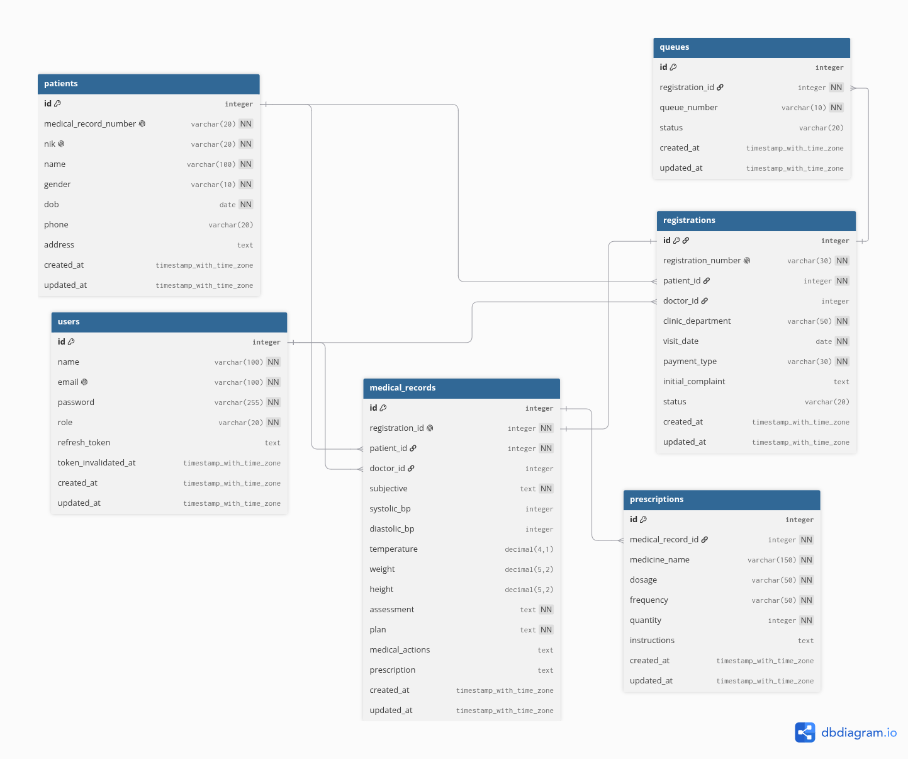

# Mini Clinic Information System

---

## Daftar Isi
1. [Entity Relationship Diagram (ERD)](#entity-relationship-diagram-erd)
2. [Cara Instalasi & Menjalankan Aplikasi](#cara-instalasi--menjalankan-aplikasi)
3. [Akun Login (Demo Seeder)](#akun-login-demo-seeder)
4. [Konfigurasi File .env](#konfigurasi-file-env)
5. [Migrasi & Seeding Database](#migrasi--seeding-database)
6. [Postman Collection](#postman-collection)
7. [Struktur Project](#struktur-project)

---

## Entity Relationship Diagram (ERD)



---

## Cara Instalasi & Menjalankan Aplikasi

Pastikan Docker Engine dan Docker Compose sudah terpasang di sistem.

1. **Clone repository dan masuk ke direktori:**
   ```bash
   git clone <URL_REPOSITORY>
   cd mini-clinic-information-system
   ```

2. **Siapkan file `.env`:**
   ```bash
   cp .env.example .env
   ```

3. **Jalankan via Docker Compose:**
   ```bash
   docker compose up -d --build
   ```

### Akses Layanan:
- **Frontend**: [http://localhost:3000](http://localhost:3000)
- **Backend API**: [http://localhost:5000/api](http://localhost:5000/api)
- **Health Check**: [http://localhost:5000/api/health](http://localhost:5000/api/health)
- **PostgreSQL**: Port `5432`

### Menghentikan Container:
```bash
docker compose down
```

---

## Akun Login (Demo Seeder)

Default password untuk seluruh akun: `password123`

| Role | Email | Password | Akses |
|---|---|---|---|
| **Admin** | `admin@clinic.com` | `password123` | Seluruh Modul |
| **Doctor** | `dr.budi@clinic.com` | `password123` | Dashboard & Pemeriksaan Pasien (SOAP) |
| **Receptionist** | `resepsionis@clinic.com` | `password123` | Dashboard, Pasien, Pendaftaran, Antrean |

---

## Konfigurasi File .env

File template `.env.example`:

```env
# Database Configuration (PostgreSQL)
POSTGRES_USER=postgres
POSTGRES_PASSWORD=postgres
POSTGRES_DB=mini_clinic_db
DB_HOST=mini_clinic_db
DB_PORT=5432
DB_USER=postgres
DB_PASSWORD=postgres
DB_NAME=mini_clinic_db

# Backend Configuration
PORT=5000
NODE_ENV=development
JWT_SECRET=super_secret_mini_clinic_jwt_key_2026
JWT_ACCESS_SECRET=super_secret_mini_clinic_jwt_access_key_2026
JWT_REFRESH_SECRET=super_secret_mini_clinic_jwt_refresh_key_2026
JWT_ACCESS_EXPIRES_IN=15m
JWT_REFRESH_EXPIRES_IN=7d
CLIENT_URL=http://localhost:3000

# Frontend Configuration
FRONTEND_PORT=3000
VITE_API_URL=http://localhost:5000/api
```

---

## Migrasi & Seeding Database

Inisialisasi skema tabel dan seed data otomatis dieksekusi dari skrip `init.sql` saat container PostgreSQL pertama kali dibuat.

Untuk melakukan **reset / re-seed database** ke kondisi awal:
```bash
docker compose down -v && docker compose up -d
```

---

## Postman Collection

File Postman Collection tersedia di root folder project:
- **`Backend.postman_collection.json`**

Import file tersebut ke aplikasi Postman untuk menguji seluruh endpoint backend API (Auth, Dashboard, Patients, Registrations, Queues, Medical Records).

---

## Struktur Project

```
mini-clinic-information-system/
├── docker-compose.yml              # Orkestrasi container (db, backend, frontend)
├── init.sql                        # Skema DDL & seed data PostgreSQL
├── Backend.postman_collection.json # Export Postman collection API
├── erd.dbdiagram.png               # Diagram relasi database (ERD)
├── .env.example                    # Template konfigurasi environment
├── .env                            # File konfigurasi environment aktif
├── .gitignore                      # Git ignore file
├── README.md                       # Dokumentasi project
│
├── backend/                        # REST API Service (Node.js & Express)
│   ├── Dockerfile                  # Container build backend
│   ├── package.json
│   └── src/
│       ├── index.js                # Server entry point & Express setup
│       ├── config/
│       │   └── db.js               # Koneksi pool PostgreSQL (pg)
│       ├── constants/
│       │   └── clinic.js           # Konstanta roles, poli, dan visit/queue status
│       ├── controllers/            # Controller endpoints (auth, patient, registration, queue, medical-record, dashboard)
│       ├── middlewares/            # JWT authentication & RBAC authorization
│       ├── routes/                 # Express router endpoints
│       └── utils/                  # Generator No. RM/Antrean, JWT helpers, JSON response format
│
└── frontend/                       # Web Client Application (React 18 & Vite)
    ├── Dockerfile                  # Multi-stage build (Vite build -> Nginx Alpine)
    ├── nginx.conf                  # Nginx configuration untuk SPA routing
    ├── package.json
    ├── vite.config.js              # Vite configuration & path alias (@/ -> src/)
    ├── tailwind.config.js          # Konfigurasi Tailwind CSS & design tokens
    ├── index.html
    └── src/
        ├── App.jsx                 # Root application component
        ├── main.jsx                # React DOM entry point
        ├── index.css               # Styling global Tailwind CSS
        ├── api/                    # Axios instances & API modules
        ├── components/             # Reusable UI components (Radix UI / Shadcn)
        ├── context/                # Global state (AuthContext & NotificationContext)
        ├── features/               # Modul fitur spesifik (auth, examinations, patients, queues, registrations)
        ├── hooks/                  # Custom React hooks (useAuth, use-mobile)
        ├── layouts/                # Layout dashboard (AppSidebar & header)
        ├── lib/                    # Helper utility (cn / classnames merge)
        ├── pages/                  # Halaman aplikasi (dashboard, patients, registrations, queues, examinations)
        └── routes/                 # Protected routes & AppRoutes configuration
```
